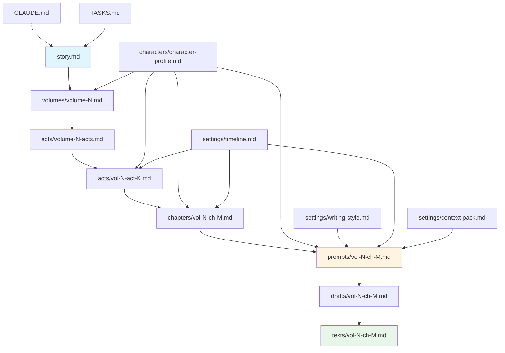

# 模板填写指引

本文档为 novel-pro 中所有模板提供详细的填写说明、使用时机、字段解释和常见问题解答。

---

## 目录

1. [核心概念](#核心概念)
2. [故事与规划模板](#故事与规划模板)
3. [设定模板](#设定模板)
4. [配置文件](#配置文件)
5. [模板关系图](#模板关系图)
6. [填写技巧](#填写技巧)

---

## 核心概念

### 模板的作用

模板是项目实例化的骨架，定义了：
- **结构**：有哪些字段
- **契约**：字段之间的依赖关系
- **用途**：谁在什么时候读取

### 模板层级

```
story.md (全书)
  ↓
volumes/volume-N.md (卷)
  ↓
acts/volume-N-acts.md (幕地图)
acts/vol-N-act-K.md (详细幕纲)
  ↓
chapters/vol-N-ch-M.md (章纲)
  ↓
prompts/vol-N-ch-M.md (单章Prompt)
  ↓
drafts/vol-N-ch-M.md (草稿)
  ↓
texts/vol-N-ch-M.md (正文)
```

### 模板元信息

核心规划模板（story/CLAUDE/TASKS/卷纲/幕纲/章纲/人物卡）含 YAML frontmatter 元信息（`template_version`、`required_fields`、`optional_fields` 等，各模板以实际字段为准）；`settings/` 下的写作辅助模板（genre-setting/world-setting/writing-style/writing-preferences/foreshadowing/timeline）为无 frontmatter 的正文模板。字段的权威定义以 `skills/planning.md`、`skills/act-planning.md`、`skills/prompt.md` 与各模板内「填写说明」为准。

---

## 故事与规划模板

### 1. story.md - 主故事文件

**位置**：项目根目录 `story.md`

**用途**：全书的核心故事和分卷规划，是整个项目的顶层锚点。

**何时填写**：
- 初始化时：自动生成框架
- 规划阶段：手动填写故事主线
- 卷纲确认后：更新对应卷的 `author_confirmed`

#### 字段详解

##### 元信息（自动生成，不要修改）
```yaml
skill_version: 5.2
runtime_profile: novel-pro-0.2
题材: {genre_id}
状态: planning
```

##### 故事主线（必填，全书锚点）

**主角想要什么**
- ✅ 正确：夺回家族传承、找到杀父仇人、证明自己不是废物
- ❌ 错误：变强、成功、幸福（太抽象）

**核心阻力**
- ✅ 正确：掌控宗门的世家势力、自身废体无法修炼
- ❌ 错误：很多困难、敌人很强（不具体）

**失败代价**
- ✅ 正确：家族彻底覆灭、一辈子被轻视
- ❌ 错误：会很惨、没有好结果（不可检验）

**最终变化**
- ✅ 正确：打破世家垄断、从废柴成为强者
- ❌ 错误：成长了、改变了（太抽象）

##### 分卷规划表

| 字段 | 说明 | 示例 |
|---|---|---|
| 卷号 | 从1开始递增 | 1, 2, 3 |
| 标题 | 本卷主题 | "废体逆袭"、"暗流涌动" |
| 章节范围 | 预估范围 | "1-50"、"51-100" |
| 本卷目标 | 阶段目标 | "通过外门考核站稳脚跟" |
| 核心冲突 | 本卷障碍 | "世家弟子打压+自身废体" |
| 卷末状态 | 状态变化 | "通过考核但暴露实力" |
| author_confirmed | 确认标记 | `true` / `false` |

**author_confirmed 使用规则**：
- 只在完成卷纲、设定、文风确认后改为 `true`
- `false` 或缺失时，无法创建 Prompt
- 这是唯一的确认标记，不要新增其他状态字段

#### 常见问题

**Q: 必须一次规划完所有卷吗？**  
A: 不必。可以先只填第一卷，写完后再规划下一卷。

**Q: 中途能改故事主线吗？**  
A: 可以，但要同步调整已规划卷的目标/冲突/状态，保持一致性。

**Q: 如何判断卷目标是否合理？**  
A: 问自己三个问题：
1. 达成这个目标会推进全书主线吗？
2. 目标是否具体到可以检验成败？
3. 卷末状态能为下一卷留下新压力吗？

---

### 2. volumes/volume-N.md - 卷纲

**位置**：`volumes/volume-N.md`

**用途**：单卷的详细规划，是驱动引擎，不是内容清单。

**何时填写**：
- 由 volume-planner 在 `outline.volume` operation 中填写
- 需要作者确认后才能推进到幕纲阶段

#### 核心字段（contract: 1）

##### 本卷目标与失败代价
```markdown
## 本卷目标与失败代价
本卷必须完成的变化：{一句话目标}；若不完成会失去什么、代价由谁承担：{具体后果}
```

- ✅ 正确：通过外门考核进入内门 / 家族会被除名
- ❌ 错误：努力修炼 / 会失败

##### 主导驱动力（五型之一）
```markdown
## 主导驱动力
类型：悬疑 / 威胁 / 目标 / 关系 / 信息差

具体驱动：{本卷用什么推动剧情}
```

**五型说明**：
- **悬疑**：核心问题是"真相是什么"（推理、调查、揭秘）
- **威胁**：核心压力是"危险在逼近"（追杀、倒计时、灾难）
- **目标**：核心动力是"必须达成某事"（考核、夺回、证明）
- **关系**：核心张力是"人与人的牵扯"（师徒、家族、对手）
- **信息差**：核心驱动是"谁知道、谁不知道"（误会、身份隐藏）

##### 卷级冲突阶梯
```markdown
## 卷级冲突阶梯
第1级：{初始对抗} → {主角应对} → {后果}
第2级：{压力升级} → {主角选择} → {代价}
第3级：{转折点} → {主角被迫} → {不可逆变化}
第4级：{最终对决} → {主角all-in} → {卷末状态}
```

**关键原则**：
- 每级比上一级更难、代价更大
- 必须有转折点（压力类型变化/误判被打破/底线被触碰）
- 最后一级兑现本卷承诺，但为下卷留新压力

##### 卷级信息差弧线（如果驱动力是信息差）
```markdown
## 卷级信息差弧线
起点：{主角/读者不知道什么}
中点：{部分揭示/新的误判}
终点：{哪些被揭示、哪些仍保留}

逐幕推进：
- 第1幕：{信息变化}
- 第2幕：{信息变化}
- 第3幕：{信息变化}
```

**注意**：不是每卷都需要完整信息差弧线，只有主导驱动力是"信息差"时才详细填写。

#### 常见问题

**Q: 冲突阶梯和幕纲的关系？**  
A: 冲突阶梯是卷级节奏设计，幕纲是拆解成具体阶段。一级冲突可能跨2-3幕。

**Q: 如何确定主导驱动力？**  
A: 问自己"本卷最核心的张力来源是什么"：
- 如果是"真相未明"→ 悬疑
- 如果是"敌人在追"→ 威胁
- 如果是"必须达成"→ 目标
- 如果是"人物牵扯"→ 关系
- 如果是"谁知/不知"→ 信息差

**Q: 卷纲写多详细？**  
A: 详细到act-planner能据此拆幕。如果拆不出来，说明还不够具体。

---

### 3. acts/vol-N-act-K.md - 详细幕纲

**位置**：`acts/vol-N-act-K.md`

**用途**：单幕的详细规划，是幕级骨架。

**何时填写**：
- 由 act-planner 在 `outline.act` operation 中填写
- 在幕地图（acts/volume-N-acts.md）完成后
- 一次负责一个详细幕纲

**完整字段说明已在模板中**，这里补充关键技巧：

#### 填写技巧

**1. start_state 必须具体**
- ❌ "主角处于困境"
- ✅ "主角被禁足戒律堂，手腕戴着灵力枷锁，必须在三天内找到证据自证清白"

**2. dramatic_task 用"通过...达到..."格式**
- ❌ "本幕要建立主角与师妹的关系"
- ✅ "通过生死危机中的互救，让主角从独行者变为信任队友"

**3. conflict_development 按时序排列**
```markdown
1. 初遇误会（约第8章）
   - 建立：主角误以为师妹是世家暗探
   - 加压：主角的孤立习惯vs需要帮助的现实
   - 转向：是独自逃还是冒险求助
   - 结果：选择独行导致重伤，被迫接受师妹救助

2. 被迫合作（约第10章）
   - ...
```

**4. continuity_contract 确保因果闭环**
- 事实主体：本幕确定的核心事实
- 退出交接：本幕产生的新事实/新压力/新信息差交给下幕

#### 与其他文件对齐

| 字段 | 对应卷纲字段 | 对应章纲字段 |
|---|---|---|
| conflict_development | 冲突阶梯某一级 | 章 `conflict` |
| information | 卷级信息差弧线某段 | 章 `characters` 的信息差轨迹 |
| character_arcs | 人物弧线某段 | 章 `characters` 的人物状态 |

---

## 设定模板

### 4. characters/character-profile.md - 人物卡

**位置**：`settings/character-setting/{character-id}.md`

**用途**：记录人物的决策引擎（欲望/恐惧/能力/盲区），不是履历表。

**何时填写**：
- volume-planner 创建主要人物
- 规划时发现需要补充时更新

#### 核心原则

人物卡是**决策引擎**，不是设定集。反复问："这条信息会改变人物的某个选择吗？"不会就删。

#### 关键字段

**desires（欲望）**：人物想要什么
- 表层目标（短期可见）
- 深层欲望（真实驱动）
- 长期志向（可选）

**fears（恐惧）**：人物最怕什么
- 核心恐惧（最深层）
- 具体担忧（本卷相关）

**capabilities（能力与限制）**：
- 实力/技能
- 智力/社交
- 资源/网络
- **能力盲区**（重要！制造冲突的来源）

**blind_spots（认知盲区）**：
- 对自己的误判
- 对他人的误判
- 对局势的误判

#### 填写技巧

1. **只写影响行动的信息**
   - ✅ 擅长察言观色、不善言辞
   - ❌ 喜欢吃甜食、血型A型

2. **反派也要有欲望/恐惧**
   - 没有内心的对手只是纸片人
   - 反派的自洽压力来自他的欲望+恐惧+盲区

3. **能力盲区决定失败方式**
   - ✅ 过度自信、无法识破伪装、对感情迟钝
   - ❌ 能力不足（太抽象）

---

### 5. settings/timeline.md - 时间线

**位置**：`settings/timeline.md`

**用途**：只记录影响后续承接的已确认时间事实。

**何时填写**：
- 规划阶段：planner记录关键时间锚点
- 创作阶段：正文写入texts/后补充实际时间
- 返修阶段：发现冲突时更新

#### 核心字段

```markdown
### {事件名称}
- 发生时间：{具体或相对时间}
- 发生地点：{具体地点}
- 事件内容：{核心事实，一句话}
- 谁知道：{信息持有范围+时间}
- 后果：{状态变化}
- 依赖关系：{前置/后续事件}
- 证据：{正文或规划路径}
```

#### 关键原则

**只记录三种事件**：
1. 改变人物状态的事件
2. 触发后续情节的事件
3. 建立/揭示信息差的事件

**不记录**：
- ❌ 纯描述性事件（主角吃了早饭）
- ❌ 无后续影响的事件（路人甲说了句话）
- ❌ 尚未确认的计划（主角打算下个月离开）

#### 信息差时间管理

悬疑/误会/身份隐藏情节的核心是：**谁在什么时候知道什么**

```markdown
- 谁知道：
  - 主角：在第20章考核当场知道
  - 师父：第15章就已知
  - 世家：第20章当天传回消息
  - 读者：第20章全知
```

---

### 6. settings/writing-style.md - 项目文风

**位置**：`settings/writing-style.md`

**用途**：项目声线的唯一权威源，包含基准样章。

**何时填写**：
- volume-planner与作者共同形成
- 作者确认后锁定

#### 核心结构

```markdown
## 声线定位
- 人称：第三人称/第一人称
- 限知：单POV限知/全知/多POV
- 距离：贴身/适中/疏离
- 基调：冷静/热血/忧郁/轻松

## 基准样章
{足以展示声线的完整段落，500-800字}

## 对照示范
### 这样写
{符合项目声线的示例}

### 不要这样写
{违反声线的反例}

## 节奏与配比
- 段落节奏：{短句/长句倾向}
- 对白/叙述比：{约X:Y}
- 感官使用：{视觉/听觉/触觉侧重}
- 章末纪律：{如何收束}

## 声线禁区
{明确不使用的表达模式}
```

#### 关键原则

**基准样章是最强的锚**：
- 必须是完整段落，能展示声线
- 不是抽象描述（"克制""冷峻"），而是可见示范
- prompt-crafter从中提取：
  - 叙述示范（用于「本章故事」）
  - 逐场落点（用于「本场声线」）

**声线传导链**：
```
style/原型 
  → writing-style.md项目样章 
  → Prompt叙述示范+落点 
  → writer执行
```

---

### 7. settings/context-pack.md - 知识预制包

**位置**：`settings/context-pack.md`

**用途**：压缩知识库，供后续prompt-crafter使用。

**何时生成**：
- 由本卷首个prompt.create任务自动生成
- 后续任务读包，不再下钻知识库

#### 核心结构（8节）

1. 读者与节奏基线（通用底座）
2. 题材执行要点（类型风格）
3. 冲突、钩点与节奏方法（通用底座）
4. **场景写法工具箱**（通用底座，按性质分条索引）
5. 人物决策与对手压力（通用底座）
6. 文风提取接口（指向writing-style.md）
7. 禁用与边界（类型风格）
8. 使用纪律

#### 关键特性

**知识压缩**：
- 从knowledge/的8-18个文件压缩为1个文件
- 只保留本卷真正用得到的方法
- 按场景性质分条索引（对峙/试探/日常/追逐等）

**按需补包**：
- 单章遇到未覆盖场景时，可注入单个知识条目
- 不必重建整包

**版本追踪**：
- 记录来源知识版本，便于诊断

---

## 配置文件

### 8. CLAUDE.md - 项目配置

**位置**：项目根目录 `CLAUDE.md`

**用途**：定义项目运行规则和流程，Agent启动时读取。

**何时生成**：初始化时自动生成

**核心内容**：
- 项目元信息（题材/profile/入口agent）
- 创作主线流程
- 状态与操作层级说明
- 版本门禁规则
- 两种创作模式说明
- 知识消费规则
- 文件路径映射

**不要修改**：除非你清楚修改的影响

---

### 9. TASKS.md - 任务清单

**位置**：项目根目录 `TASKS.md`

**用途**：Novel Desk与novel-agent的任务交接文件。

**何时生成**：首次创建Desk任务时生成（不是初始化时）

**字段结构**（以 `templates/TASKS.md` 为权威源）：
```markdown
## {任务简述}

status: pending
source:
  path: {来源文件路径}
  content_hash: {来源内容 hash}
  anchor: {可选锚点}
scope: {拟处理范围说明（自由文本）}
operation: {将采用的既有 Skill operation}
result:
  summary: {完成/受阻/取消后回写}
  files: [{结果文件路径}]
```

**状态流转**：
```
pending -> in_progress -> completed / blocked / cancelled
```

**注意**：
- 不是第二套状态机
- 不替代.agent/控制面文件
- 没有Novel Desk可以不用

---

## 模板关系图



**图例**：
- 蓝色：顶层配置
- 黄色：Prompt层（关键转换点）
- 绿色：最终产物
- 实线：直接依赖
- 虚线：配置关系

---

## 填写技巧

### 通用原则

1. **具体优于抽象**
   - ❌ "主角很强"
   - ✅ "筑基初期修为，擅长剑法，有一件护身法器"

2. **可检验优于不可检验**
   - ❌ "本章要有张力"
   - ✅ "本章结束时主角暴露身份，引来世家关注"

3. **事实优于意图**
   - ❌ "为后续做铺垫"
   - ✅ "师父受伤闭关，无法再护住主角"

4. **影响行动优于装饰信息**
   - ✅ 人物误判、能力盲区、底线
   - ❌ 血型、星座、喜好

### 字段链对齐

确保字段从上到下对齐：

```
卷纲.冲突阶梯
  ↓
幕纲.conflict_development
  ↓
章纲.本章阻力
  ↓
Prompt.场景展开
```

如果下游无法从上游拆解出内容，说明上游还不够具体。

### 避免常见错误

**错误1：把模板当设定集**
- 不要堆砌无关信息
- 每条信息都要问"会改变什么选择吗"

**错误2：依赖外部引用**
- ❌ "如上一章所述"
- ✅ 内化为当前状态

**错误3：用标签代替内容**
- ❌ "本章质感：冷峻克制"
- ✅ 提供具体的声线落点和样句

**错误4：混淆不同层级**
- 卷纲写的是驱动力和冲突阶梯
- 不要写成章节清单

---

## 快速查找表

| 我想... | 应该填写... | 关键字段 |
|---|---|---|
| 规划全书 | story.md | 故事主线、分卷规划 |
| 规划一卷 | volumes/volume-N.md | 冲突阶梯、信息差弧线 |
| 规划一幕 | acts/vol-N-act-K.md | dramatic_task、conflict_development |
| 规划一章 | chapters/vol-N-ch-M.md | 本章目标、场景清单 |
| 创建人物 | characters/character-profile.md | desires、fears、blind_spots |
| 记录时间 | settings/timeline.md | 事件、谁知道、后果 |
| 定义文风 | settings/writing-style.md | 基准样章、声线禁区 |
| 配置项目 | CLAUDE.md | 自动生成，一般不改 |
| 创建任务 | TASKS.md | Novel Desk创建，Agent处理 |

---

## 下一步

完成模板填写后：
- 查看 [新手入门指南](getting-started.md)
- 查看 [示例文档](examples.md)
- 查看 [框架总览](framework-overview.md)

有问题？查看各模板内的FAQ或提问作者。